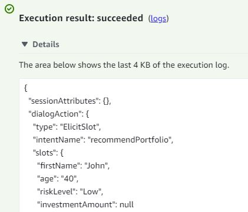
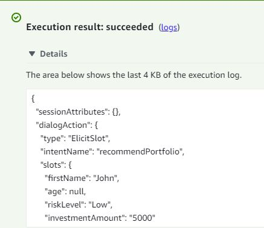
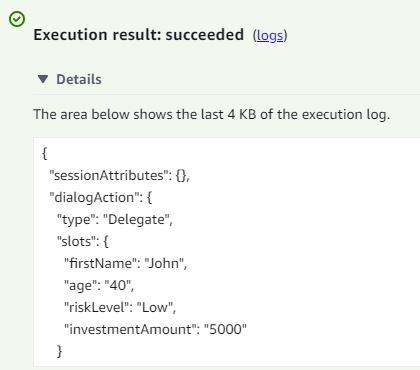

# AWS Robo Advisor

### Conversational User Interfaces (CUIs) powered by AI are becoming an integral part of our day-to-day life. One of the CUI's applications is investment advise. AWS Robo Advisor tool is one of tho examples of such a service. The tool uses Amazon Lex to create a chatbot that advises people about retirement plan options based on their risk tolerance profile.

---

---

## Table of contents

1. [Technologies](#technologies)
2. [Usage](#usage)
3. [Contributors](#contributors)
4. [License](#license)

---

## Technologies

`Python 3.7` 
[Amazon AWS](https://aws.amazon.com/)

---

## Usage

> Application summary 

AWS Robo Advisor application creates a bot that recommends an investment portfolio for a retirement plan. The process consists of the following parts: 

- Configure the initial robo advisor: Define an Amazon Lex bot with a single intent that establishes a conversation about requirements to suggest an investment portfolio for retirement.
- Build and test the robo advisor and demonstrate that our bot works and accurately responds during the conversation with the user.
- Enhance the robo advisor with an Amazon Lambda function: we build an Amazon Lambda function that validates the user's input and returns the investment portfolio recommendation. This includes testing the Amazon Lambda function and integrating it with the bot.

**Configuring the initial bot:** 

1. We create a new Amazon Lex bot with the following criteria: 

   - Bot name: RoboAdvisor

   - Language: English (US)

   - Output voice: Salli

   - Session timeout: 5 minutes

   - Sentiment analysis: No

   - COPPA: No

   - Advanced options: No

   - All other options: The default value 

2. We add a new intent, and name it recommendPortfolio: 

3. The intenet will be configured as follows:: 

   - Utterances: 
      

   - Slots: 
      

   - Confirmations: 
      

**Build and test the robo advisor** 

- Play video to verify that the bot works and accurately responds during the conversation with the user:

  <video src=Images/Robo_Advisor_Test1_20230309.mp4 controls="controls" style="max-width: 730px;"></video>

**Enhance the robo advisor with an Amazon Lambda function** 

1. We create a new Lambda function and name it recommendPortfolio.

2. In the online code editor, we delete the AWS-generated default lines of code, and then paste in the provided starter code from lambda_function.py.

3. We complete building the function by adding the validation rules and the investment recommendations based on the investor's risk profile

4. We test the function by using the provided test events:

   - Age error 
      
   - Incorrect Amount Error: 
      
   - Negative Age Error: 
      
   - Correct Dialog 
      

5. We integrate the lambda function in our bot.

6. Play video to verify that the bot works and accurately responds during the conversation with the user:

   <video src=Images/Robo_Advisor_Test2_20230310.mp4 controls="controls" style="max-width: 730px;"></video>

> Getting started 

- To use AWS Robo Advisor first clone the repository to your PC. 
- Open `Jupyter lab` as per the instructions in the [Installation Guide](#installation-guide) to run the application. 

---

## Contributors

Contact Details:

Boris Dudkin:

- [Email](boris.dudkin@gmail.com)
- [LinkedIn](www.linkedin.com/in/Boris-Dudkin)

---

## License

MIT

---
